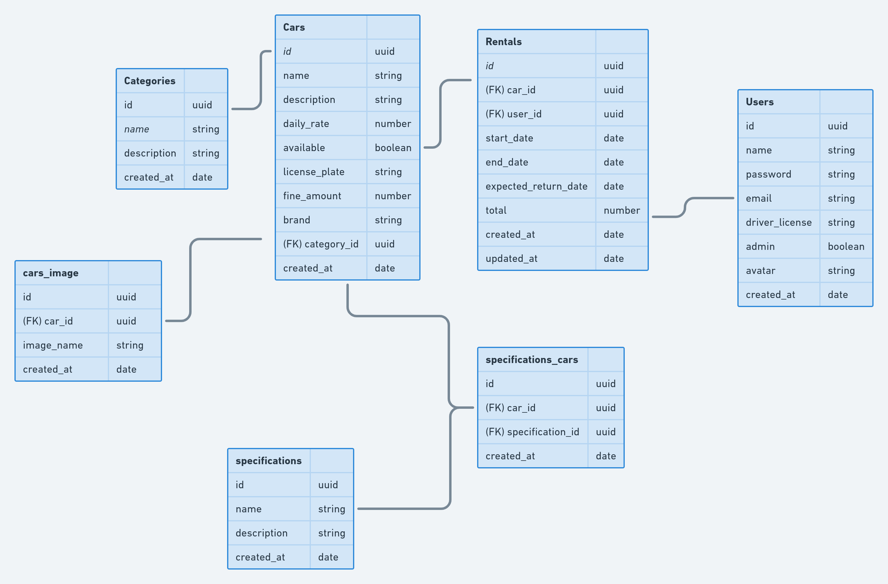

  
  <h1>Ignite - Node.js</h1>
  <h4>
    RentX - API de alugueis de carros do treinamento Ignite - Trilha Node.js -
    <a href="https://www.rocketseat.com.br" target="_blank">
      RocketSeat 🚀
    </a>
  </h4>

## Legendas

- **RF**: Requisitos Funcionais
- **RNF**: Requisitos Não Funcionais
- **RN**: Regras de Negócio

## Cadastro de carro

**RF**

- [x] Deve ser possível cadastrar um novo carro.

**RN**

- [x] Não deve ser possível cadastrar um carro com uma placa já existente.
- [x] O carro deve ser cadastrado, por padrão, com disponibilidade.
- [x] O usuário responsável pelo cadastro deve ser um usuário administrador.\*

## Listagem de carros

**RF**

- [x] Deve ser possível listar todos os carros disponíveis
- [x] Deve ser possível listar todos os carros disponíveis pelo `nome da categoria`
- [x] Deve ser possível listar todos os carros disponíveis pelo `nome da marca`
- [x] Deve ser possível listar todos os carros disponíveis pelo `nome do carro`

**RN**

- [x] O usuário não precisar estar logado no sistema.

## Cadastro de Especificação no carro

**RF**

- [x] Deve ser possível cadastrar uma especificação para um carro

**RN**

- [x] Não deve ser possível cadastrar uma especificação para um `carro não cadastrado`.
- [x] Não deve ser possível cadastrar uma `especificação já existente para o mesmo carro`.
- [x] O usuário responsável pelo cadastro deve ser um usuário `administrador`.

## Cadastro de imagens do carro

**RF**

- [x] Deve ser possível cadastrar a imagem do carro

**RNF**

- [x] Utilizar o multer para upload dos arquivos

**RN**

- [x] O usuário deve poder cadastrar `mais de uma imagem para o mesmo carro`
- [x] O usuário responsável pelo cadastro deve ser um usuário `administrador`.

## Alugel de carro

**RF**

- [x] Deve ser possível cadastrar um aluguel

**RN**

- [x] O aluguel deve ter duração `mínima de 24 horas`.
- [x] Não deve ser possível cadastrar um novo aluguel caso já exista um `aberto para o mesmo usuário`
- [x] Não deve ser possível cadastrar um novo aluguel caso já exista um `aberto para o mesmo carro`
- [x] O usuário deve estar `logado na aplicação`
- [x] Ao realizar um aluguel, o status do carro deverá ser `alterado para indisponível`

## Devolução de carro

**RF**

- [x] Deve ser possível realizar a devolução de um carro

**RN**

- [x] Se o carro for devolvido com menos de 24 horas, deverá ser cobrado diária completa.
- [x] Ao realizar a devolução, o carro deverá ser liberado para outro aluguel.
- [x] Ao realizar a devolução, o usuário deverá ser liberado para outro aluguel.
- [x] Ao realizar a devolução, deverá ser calculado o total do aluguel.
- [x] Caso o horário de devolução seja superior ao horário previsto de entrega, deverá ser cobrado multa proporcional aos dias de atraso.
- [x] Caso haja multa, deverá ser somado ao total do aluguel.
- [x] O usuário deve estar logado na aplicação

## Listagem de Alugueis para usuário

**RF**

- [x] Deve ser possível realizar a busca de todos os alugueis para o usuário

**RN**

- [x] O usuário deve estar logado na aplicação

## Recuperar Senha

**RF**

- [x] Deve ser possível o usuário recuperar a senha informando o e-mail
- [x] O usuário deve receber um e-mail com o passo a passo para a recuperação da senha
- [x] O usuário deve conseguir inserir uma nova senha

**RN**

- [x] O usuário precisa informar uma nova senha
- [x] O link enviado para a recuperação deve expirar em 3 horas

# Diagrama de Classes

